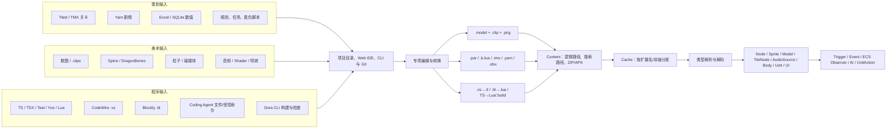

# Dora-SSR 模型资产与策划—美术—程序协同分析

> 分析对象：`F:\GitHub\Dora-SSR`
> Git 基线：`main @ 9756e311494a41aa28339afbc719b8e927e4a7c8`
> 分析日期：2026-07-14
> 对照快照：首次报告为 `e363dc89c8240c3c6a6e220ce649145feeac18b9`。两快照从 `c2b4f9389c830f8ab07c7d572eeec5826a766f8e` 分叉，旧提交不是新 HEAD 的祖先，因此本报告按快照净差异重审，不作错误的线性升级叙事。
> 范围说明：本报告分析该仓库中的引擎、Web IDE、工具、文档和示例所能证明的能力，不把外部游戏项目、未安装插件或团队口头流程推定为仓库能力。

## 一、结论先行

Dora-SSR 的准确定位是：**代码驱动、面向 2D 的游戏引擎与 Web IDE，配有若干专项内容编辑器和 AI 编程代理**。它不是 Unity/Unreal 式、由统一 Scene/Prefab/Material/AssetDB 驱动的全职能内容生产平台。

核心判断如下：

1. 仓库中的 `Model` 是 **2D 层级动画模型**，主链为“散图/图集描述与 `.model` XML → Action Editor → `.png + .clip + .model` → Content 路径解析 → Model/Clip/Texture Cache → Node/Sprite/Animation 实例”。Spine、DragonBones 则直接消费外部工具导出的骨骼运行时格式。
2. 资产管理采用 **原始格式随包分发 + 字符串路径引用 + 搜索路径解析 + 分类型内存缓存**。未发现 GUID/meta、AssetDB、依赖图、统一导入器、派生数据缓存或自动资源 cooking/裁剪。
3. 三类岗位的共同接口不是中央资产数据库，而是同一项目目录中的 **Excel、Yarn、TMX、XML/JSON、图片/音频、脚本及约定字符串**。协作可以成立，但重命名、字段漂移、缺失资源和事件名不一致主要靠人工发现。
4. 能力强弱大致是：**程序生产链最完整，并新增正式 Dora CLI、动态 DoraX、增强输入和 Web IDE Git 工作流；策划有剧情、地图载入、Excel/ECS、Platformer 战斗等可靠基础；美术有 2D 动画、图集、碰撞体、粒子、骨骼预览等专项链路，但缺统一场景、材质、灯光和风格 QA 管线。**
5. Coding Agent 的工具面已扩展到受控 HTTP(S) 下载与 Dora Lua/Git 命令，但默认关闭、需逐任务显式启用；自然语言生成仍明确落到 Blockly/Lua。它不是把策划文档自动编译成关卡、任务、灯光和完整玩法蓝图的领域编译器。

下文状态含义：

- **原生闭环**：仓库内有明确编辑/生成、运行时和调用链。
- **可组合实现**：底层组件具备，但项目需自行定义 schema、规则或脚本。
- **未提供专用管线**：第一方源码和文档中未发现对应领域资产、编辑器或验证器。

### 1.1 本轮更新真正改变了什么

净差异有 2,727 个文件，其中 2,433 个是新增，绝大部分来自 vendored SDL2/Wa 源码，不能等同为制作能力增长。对资产与三职能协同真正有影响的变化如下：

| 变化 | 新快照事实 | 对原结论的影响 |
|---|---|---|
| Dora CLI | 删除外置 Python sidecar，改由桌面 Dora 可执行文件启动最小 Lua CLI；提供 `build/run/buildrun/stop/status/doctor/log/doc search/read`，支持 `--asset`、多语言和 Yarn 检查 | 制作/验证入口显著增强；不等于新增资产 cook |
| 剧情门禁 | `.yarn` 被纳入统一 CLI build，并调用 `/yarn/check-file` | 剧情从编辑器检查进一步进入命令行构建门禁 |
| Coding Agent | 新增可开关的 `fetch_url` 与 `execute_command(lua\|git)` | Agent 可下载资源、做受控运行时/Git 操作；仍无关卡/任务/材质领域工具 |
| DoraX | 新增 `createRoot + signal`、diff、key、unmount 和 hooks | UI/场景脚本从一次性 TSX 构造升级为代码式响应渲染 |
| 输入与版本协作 | InputManager 订阅/context API 增强；Web IDE Git 面板支持 diff、stage、commit、分支和远端 | 触发器工程化和跨岗位文本资产协作明显改善 |
| Spine | 两快照都已是 4.3；本轮只增强 Skeleton 同步加载判空与 parser 错误诊断 | 诊断改善，版本和资产架构不变 |
| 旧核心风险 | 缓存 key、搜索路径、clip 序列化、Spine 卸载、DragonBones 扩展名、音频伪流式仍在 | 原 P0/P1 改造优先级不变 |

证据见 [Dora CLI 教程](<F:/GitHub/Dora-SSR/Docs/docs/tutorial/115.command-line-interface.mdx:1>)、[AgentToolRegistry.ts](<F:/GitHub/Dora-SSR/Assets/Script/Lib/Agent/AgentToolRegistry.ts:227>)、[DoraX.ts](<F:/GitHub/Dora-SSR/Assets/Script/Lib/DoraX.ts:2421>) 和 [InputManager.tsx](<F:/GitHub/Dora-SSR/Assets/Script/Lib/InputManager.tsx:1475>)。

## 二、模型与资产是怎么走的

### 2.1 总体资产流

这个图中最重要的不是格式数量，而是中间没有“统一导入数据库”这一层。资产和逻辑通过文件路径直接相遇。

### 2.2 内建 2D Model 的完整链路

1. **创作输入**：Action Editor 读取散图目录、`.clips` 图集描述、`.clip` 与 `.model`。`.model` 被源码明确称为 2D model，包含 clip 文件、Sprite 层级、动作、外观、关键点和关键帧信息。证据见 [ModelDef.h](<F:/GitHub/Dora-SSR/Source/Animation/ModelDef.h:70>)。
2. **图集生成**：`ActionAtlasPacker` 枚举图片、解码并绘制 canvas，写出 PNG 和 legacy `.clip`，随后通知文件更新。见 [ActionAtlasPacker.ts](<F:/GitHub/Dora-SSR/Tools/dora-dora/src/ActionEditor/ActionAtlasPacker.ts:145>)。
3. **模型保存**：编辑器把层级与动画写回紧凑 XML `.model`，并约定同名 `.clip`。见 [ActionLegacyModel.ts](<F:/GitHub/Dora-SSR/Tools/dora-dora/src/ActionEditor/ActionLegacyModel.ts:215>) 和 [ModelDef.cpp](<F:/GitHub/Dora-SSR/Source/Animation/ModelDef.cpp:167>)。
4. **定位与读取**：`Content` 以字符串路径、搜索路径和 ZIP/APK 包解析真实文件；不是 GUID 查找。见 [Content.cpp](<F:/GitHub/Dora-SSR/Source/Basic/Content.cpp:920>)。
5. **运行时解析**：`Model(filename)` 自动补 `.model` 并交给 `SharedModelCache`；ModelCache SAX 解析 XML，并按模型所在目录解析相对 `.clip` 和帧引用。见 [Model.cpp](<F:/GitHub/Dora-SSR/Source/Node/Model.cpp:49>)、[ModelCache.cpp](<F:/GitHub/Dora-SSR/Source/Cache/ModelCache.cpp:20>)。
6. **实例化**：引擎递归把 `SpriteDef` 转为 Node/Sprite 树，再创建动画组；实例持有引用计数对象。模型定义进缓存，场景实例不是重新复制一套磁盘资产。
7. **释放**：缓存通过 `unload/removeUnused` 与引用计数回收，没有磁盘派生缓存、容量预算或 LRU。见 [Object.h](<F:/GitHub/Dora-SSR/Source/Basic/Object.h:40>)、[XmlItemCache.h](<F:/GitHub/Dora-SSR/Source/Cache/XmlItemCache.h:121>)。

### 2.3 其他美术资产链

| 资产 | 生产/输入 | 运行时消费 | 判断 |
|---|---|---|---|
| Spine | 外部 DCC 导出 `.skel/.json + .atlas + texture` | SkeletonCache、Spine 节点 | 有运行时与预览，无内建绑定/权重创作；新版改善加载失败诊断 |
| DragonBones | 外部导出 `_ske.json + _tex.json + texture` | DragonBoneCache、Armature | 有运行时，无完整内建骨骼创作 |
| TMX 地图 | 外部 Tiled 制作 | TMXCache → TileNode → TextureCache | 有地图导入与运行时，无内建地图制作器 |
| 碰撞体 | Body Editor 编辑 Lua/JSON 形式 | BodyEx → BodyDef/Body | 有专项编辑与物理预览 |
| 粒子 | Particle Editor 编辑 XML 参数 | ParticleCache/Particle 节点 | 有简单粒子编辑；高级 VFX 依赖 Effekseer 等外部工具 |
| 音频 | WAV/OGG/MP3/FLAC 文件 | AudioCache → AudioSource/AudioBus | 播放、滤镜、3D 衰减齐全；无音频 DCC/动态配乐编辑器 |
| Shader/Effect | `.sc` 与平台 shader binary | ShaderCache → Pass/Effect | 是运行时渲染基础，不等于通用可序列化 Material 资产 |

统一缓存路由实际支持 clip/frame/model/particle、常见纹理、SVG、shader、音频和 TMX，并支持 `model:`、`spine:`、`bone:`、`font:` 等前缀，见 [Cache.cpp](<F:/GitHub/Dora-SSR/Source/Cache/Cache.cpp:32>)。

### 2.4 构建、打包和热更新边界

- 开发期直接通过 `--asset ../../Assets` 指向原始资产目录；发行工作流把 Web IDE、Doc/Font/Image/Script 等原始资源与程序一起归档。
- 新版把平台 build/run wrapper 和 CI 明显统一，并新增 Dora CLI；CLI 可选择 `--asset`、构建/运行项目、诊断服务、查文档并检查 Yarn。它提升的是**引擎与脚本工作流的可重复性**，不是按引用图烘焙资源。
- WebServer 的读、编译和运行接口现在能显式携带 project root，并把项目根与 `project/Script` 接入解析路径；多项目工作区更可靠，但底层引用仍是字符串路径。
- 游戏打包教程仍要求手工组织 Assets、删除开发目录、设置搜索路径。WebServer 的 ZIP 功能是文件归档，不是依赖扫描/cook。见 [游戏打包教程](<F:/GitHub/Dora-SSR/Docs/docs/tutorial/130.game-app-pack.mdx:24>)。
- Web IDE 的脚本构建生成 Lua、同名产物或 `.build`；这与“资源烘焙”是两件事。
- `Cache::update` 只覆盖部分文本资源及显式 Texture；Web `/write` 落盘并不会自动使所有缓存与现存实例刷新。因而“编辑器保存后运行场景原位更新”不是全局保证。
- Shader 会按 renderer 选择 dx11/pssl/metal/glsl/essl/spirv 变体，跨平台包必须显式确保正确目录存在。见 [ShaderCache.cpp](<F:/GitHub/Dora-SSR/Source/Cache/ShaderCache.cpp:42>)。

## 三、策划、美术、程序如何协同

### 3.1 协同本质：弱类型文件契约

三方并非围绕一个可视化场景资产协作，而是围绕以下契约协作：

| 契约 | 主要生产者 | 主要消费者 | 典型断点 |
|---|---|---|---|
| Excel 列名、列位置、数值和资源路径 | 策划 | Struct/Entity/Observer、UI、战斗脚本 | 表头变化、范围错误、资源不存在，无 schema/外键检查 |
| TMX layer/object/class/property 和 tileset path | 关卡策划、美术 | TileNode、碰撞/出生/交互脚本 | 对象语义由项目约定，无关卡规则 validator |
| Yarn node、变量、command 名与参数 | 剧情策划 | YarnRunner、UI、程序 command 回调 | 命令拼写和跨系统绑定依赖约定 |
| `.model/.clip`、Spine/DragonBones 名称与动画名 | 美术 | UnitDef、Action、AI、UI | 改名/移动后字符串引用失效 |
| ECS component、event、Input action 名 | 策划/程序共同定义 | Group/Observer、Node slot/gslot、Trigger | 任意字符串，无集中枚举或版本契约 |
| `.vs/.bl` 与生成的 `.tl/.lua` | 程序/技术策划 | 编译器、运行时 | 源与派生产物同步、编译错误映射 |

仓库给出的项目管理方式也印证了这一点：含 `init.*` 的目录就是项目根，推荐在其中放 Data、Font、Script 等目录，IDE 从当前文件向上寻找 `init` 运行。见 [项目管理教程](<F:/GitHub/Dora-SSR/Docs/docs/tutorial/100.project-management.mdx:10>)。

### 3.2 四条真实的跨职能链

#### A. 数值表 → ECS → 美术/物理对象

Platformer 教程从 `Data/items.xlsx` 读取行数据，表中可以直接保存 `Model/patreon.clip|sloth` 一类美术子资源字符串；程序把行转为 Entity，Observer 再实例化 Unit/Sprite/Body，并用 `BodyEnter` 处理拾取。

这条链的岗位关系是：

`策划维护字段与数值 → 美术提供路径和子资源名 → 程序定义表头解释、Entity 组件和 Observer → 运行时生成对象`

证据见 [Excel loader 教程](<F:/GitHub/Dora-SSR/Docs/docs/example/100.Platformer%20Tutorial/8.loader.mdx:15>) 与 [logic 教程](<F:/GitHub/Dora-SSR/Docs/docs/example/100.Platformer%20Tutorial/7.logic.mdx:32>)。

#### B. Yarn 剧情 → 程序命令 → 游戏状态与表现

Yarn 负责节点、分支、变量、跳转、选项和 command；YarnRunner 把每个节点编译为 Lua，通过 `advance(choice)` 返回文本/选项，并调用程序注册的 command/state 回调。

所以剧情可独立迭代文本和分支，但动画、音频、任务进度、镜头或战斗触发仍需要程序把 command 接入相应系统。新版又把单文件/项目级 `.yarn` 检查接入 `Dora cli build --lang yarn`；Yarn 的编辑、Tester、服务端检查和 CLI 门禁使它成为仓库中策划链路最接近完整闭环的一项。CLI 新增的是检查入口，服务端 `/yarn/check-file` 并非新剧情模型。

#### C. TMX 地图 → TileNode → 项目脚本解释

关卡/美术在 Tiled 中维护图层、对象、自定义属性和 tileset；引擎把 `.tmx` 交给 TMXCache/TileNode，程序再解释对象层中的出生点、碰撞体、触发区等语义。

这能完成 2D 关卡，但仓库没有敌群、波次、任务目标、通关条件等统一关卡 schema。换言之，**地图是原生资产，关卡规则仍是项目脚本。**

#### D. 可视脚本/Agent → 代码产物 → 构建门禁

- CodeWire：`.vs` 节点图 → 同名 `.tl` → 编译检查，并把错误定位回节点。
- Blockly：`.bl` 工作区 JSON → 同名 `.lua`；`BlocklyCoder` 还能执行“自然语言 → TypeScript 积木 DSL → Blockly → Lua”，编译失败时回送模型修正。
- Coding Agent：除通用文件、API 搜索和 build 外，新版可在用户显式开启时执行 HTTP(S) 下载及受控 Dora Lua/Git 命令；Web IDE 另有完整 Git 面板。它仍没有专用的关卡、任务、材质或风格资产生成工具。
- Dora CLI：把多语言脚本、Yarn、运行、doctor、日志与文档检索放到统一命令入口，可作为 Agent/CI/人工制作的共同验证表面。

证据见 [App.tsx](<F:/GitHub/Dora-SSR/Tools/dora-dora/src/App.tsx:2536>)、[BlocklyCoder.ts](<F:/GitHub/Dora-SSR/Assets/Script/Tools/BlocklyCoder.ts:349>)、[AgentToolRegistry.ts](<F:/GitHub/Dora-SSR/Assets/Script/Lib/Agent/AgentToolRegistry.ts:227>)。

## 四、用户所列能力逐项判定

### 4.1 策划

| 子项 | 状态 | 仓库中的实际落点 | 关键缺口 |
|---|---|---|---|
| 关卡 | **原生地图载入 + 可组合规则** | Tiled/TMX、TMXCache、TileNode、Node/ECS、碰撞与事件 | 无统一关卡编辑器、敌群/波次/目标/通关 schema；TMX 对象语义由脚本解释 |
| 剧情 | **原生闭环，构建门禁增强** | Yarn Editor/Convert/Check/Tester、YarnRunner、Lua 编译、CLI 项目/单文件检查、command/state 回调 | 动画、音频、任务等跨域表现仍需程序绑定；无剧情/任务语义 schema |
| 系统 | **可组合实现，输入协作增强** | ECS、Node、Event、增强 InputManager、SQLite、脚本和协程 | 组件/事件/action/context 仍是开放字符串，无策划域 schema、版本与校验 |
| 战斗 | **原生的 Platformer 专项框架** | Data、Unit、UnitAction、Bullet、AI/Decision/Behavior、PlayRho | 不是通用战斗编辑器；数值引用完整性和可视调试需项目补充 |
| 数值 | **原生数据入口 + 项目自建模型** | Excel → Lua table/Struct/Entity，SQLite，Data.store | 无字段类型、范围、外键、资源存在性、版本迁移和自动平衡校验 |
| 任务与胜负条件 | **可脚本实现；未提供专用管线** | Yarn state/command、ECS、Event、DB、示例中的显式 `isGameOver`/碰撞判定 | 无 Quest/Mission/Objective、目标树、奖励、任务日志、胜负条件资产或编辑器 |

### 4.2 美术 / 艺术

| 子项 | 状态 | 仓库中的实际落点 | 关键缺口 |
|---|---|---|---|
| 地形 / 场景 / 物体 | **2D 物体原生；场景与地形部分可组合** | Node/Sprite/Model、TMX/TileNode、Action Editor、Body Editor、Spine/DragonBones | 无统一 Scene/Prefab Inspector；无第一方 3D Terrain/完整 3D 管线 |
| 音频音效 | **运行时原生** | AudioSource、AudioBus、WAV/OGG/MP3/FLAC、滤镜、fade、3D 空间声 | 无波形/音乐制作器、动态配乐或内容感知混音工作流 |
| 灯光 / 材质 / 物理参数 | **物理原生；Shader 基础可用；灯光/通用材质未提供** | Body Editor、PlayRho、ShaderCache、Effect/Pass/uniform/texture | 无第一方 Light 系统、Material 资产/编辑器；Effect 不能等同完整材质管线 |
| 声光力自动调整 | **仅局部运行时自动计算** | 声源跟随 Node 世界变换，距离衰减/Doppler；物理求解器自动模拟力和碰撞 | 未发现自动混音、自动布光、物理参数智能调优或难度/表现自平衡 |
| 风格一致性审查 | **未提供资产级自动 QA** | `ui-design` skill 有配色、交互态、响应式、图标等生成规范 | Agent 无截图/视觉分析、音频分析、配色/构图度量或自动质量门禁；它是指导清单，不是审查器 |

官方概览也明确说明完整 3D 渲染、3D 动画模型、材质管理和完整 3D 管线尚未实现，见 [Dora SSR overview](<F:/GitHub/Dora-SSR/Docs/blog/2024-8-14-dora-ssr-overview.mdx:20>)。

### 4.3 程序

| 子项 | 状态 | 仓库中的实际落点 | 边界 |
|---|---|---|---|
| 蓝图生成 | **有 CodeWire 可视脚本；不是 Unreal Blueprint** | `.vs` 节点/连线 JSON → `.tl` → 编译检查 | 主要是通用控制流；无 Actor/Component 反射、统一场景序列化、资产依赖图或 Blueprint VM |
| 积木代码生成 | **原生闭环** | Blockly `.bl` → Lua；BlocklyCoder 支持自然语言生成与失败修正 | 生成的是程序积木，不是关卡、灯光、任务图或完整玩法资产 |
| 触发器 | **原生闭环，接口增强** | InputManager Trigger、`on/once/off/onCompleted`、context stack、Node `slot/emit` 与 `gslot`、ECS Observer | 分散在三套机制中，action/context 仍为字符串，缺统一领域事件 schema |
| 交互逻辑 | **可组合实现** | 输入、触摸、碰撞、事件、ECS、协程和逐帧调度 | 无单一“交互图资产”；由脚本组合 |
| 行为脚本 | **原生，尤其 Platformer** | UnitAction、Decision Tree、Behavior Tree、AI 节点、脚本扩展 | 领域重点是 2D Platformer，不是全类型游戏行为编辑器 |
| UI / 任务 / 战斗脚本 | **UI 与战斗基础明确；任务需自建** | DoraX `toNode` 与 `createRoot/signal/hooks`、AlignNode/Yoga、ImGui；Platformer 战斗；Yarn/ECS/Event 可搭任务 | UI 已支持代码式响应 diff，但无通用 WYSIWYG；任务目标/奖励/胜负模型缺失 |

## 五、当前协作模型的优势与主要风险

### 优势

- 内容格式透明，多数是 XML/JSON/TMX/Yarn/Excel/脚本，适合 Git、批量生成和 Agent 修改。
- Web IDE 把代码、Yarn、Action、Body、Particle、Blockly、CodeWire 等入口聚在一起，专项工具和运行时贴得很近。
- Yarn、Blockly/CodeWire、Platformer、ECS 都有明确的“可编辑源 → 可执行产物/运行时”链路。
- CLI 把脚本/Yarn 构建、运行、doctor、日志和文档查询统一起来；Web IDE Git 面板使文本内容与代码变更更可见。
- Agent 有 API 搜索、build gate 及显式授权的下载/受控命令，生成代码不会只停在文本建议层。
- 轻量路径与分类型缓存对于小型 2D 项目成本低、启动直接。

### 主要风险

1. **字符串即接口**：资源、动画、事件、组件、Yarn command、TMX 对象名都靠字符串；重命名与跨岗位变更没有稳定 ID 或集中引用修复。
2. **缺少 schema 和验证器**：Excel/TMX/UnitDef/任务条件缺字段类型、范围、外键、资源存在性与版本校验，错误偏晚暴露。
3. **保存不等于刷新**：编辑器写盘、路径缓存、资源缓存和已有运行实例之间没有统一失效协议。
4. **打包不可推导**：没有依赖 manifest 与确定性 staging/cook，平台 shader 变体、大小写、符号链接和漏资源需要人工兜底。
5. **职能成熟度不均衡**：程序可视化与生成链较强，但任务/胜负、场景/Prefab、灯光/材质、自动风格 QA 没有对应产品层。
6. **仓库中的关键实现风险**：包括异步 XML 缓存 key 不一致与异常路径未初始化指针、搜索路径移除后的迭代器失效、追加搜索路径不清 full-path cache、Spine 卸载短路、DragonBones atlas 扩展名判断疑似笔误，以及音频“stream”仍先整文件入内存。本轮逐项复核后全部仍成立。
7. **潜在序列化与 CLI 根路径边角**：`ClipDef::toXml` 格式仍可疑，但第一方当前无调用点，应列为潜在 C++ serializer 风险而非“编辑器必然写坏”；CLI 的一部分根路径仍从脚本目录推导，尚未完全统一到注入的 asset root。

高风险代码位置： [XmlItemCache.h](<F:/GitHub/Dora-SSR/Source/Cache/XmlItemCache.h:67>)、[Content.cpp](<F:/GitHub/Dora-SSR/Source/Basic/Content.cpp:1021>)、[Cache.cpp](<F:/GitHub/Dora-SSR/Source/Cache/Cache.cpp:275>)、[DragonBoneCache.cpp](<F:/GitHub/Dora-SSR/Source/Cache/DragonBoneCache.cpp:205>)、[AudioCache.cpp](<F:/GitHub/Dora-SSR/Source/Cache/AudioCache.cpp:33>)。

## 六、建议的建设顺序

### P0：统一资源 key 与缓存路由

- 建立 `canonicalAssetKey()`，让同步/异步加载、update、unload 使用同一 key。
- 修复异步 XML 未初始化指针、搜索路径迭代器和缓存失效问题。
- 用单一类型表生成各类资源的 load/loadAsync/update/unload 路由。
- 验收：同一资源的相对/绝对路径与同步/异步请求只形成一个缓存项；坏 XML 稳定失败且不入缓存；搜索路径增删立即生效。

### P0：打通“编辑器保存 → 运行时失效 → 实例重建”

- 保存成功后发布 `{canonicalPath, type, contentHash, operation}`。
- 中央 invalidator 执行路径缓存清理与 `Cache.update/unload`；首期让预览对象重建，不强求所有类型原位 patch。
- 验收：修改 `.model/.clip/texture` 后预览 1 秒内刷新；删除和重命名不会继续命中旧资源。

### P1：建立资产 manifest 与构建期验证

- 扫描 `.model/.clip/.frame`、TMX、Spine、DragonBones、音频、shader 等引用，生成确定性 JSON manifest：规范路径、类型、hash、直接依赖、平台标签。
- 同一验证器同时检查 Excel 资源字段、UnitDef、TMX 属性和 Yarn command 契约。
- 验收：缺失纹理、大小写冲突、非法 XML、错误外键、缺少 shader 变体均使构建失败，并打印完整引用链。

### P1：可复现的跨平台 staging/cook

- 以 manifest 为输入，统一筛选发布文件、展开必要链接、选择 renderer shader 变体并生成资产清单/hash。
- 验收：干净 checkout 能用一条命令生成目标平台资产；两次构建的清单字节一致；可在仓库外工作目录启动。

### P1：补策划领域契约

- 先定义最小 `LevelDef / QuestDef / ObjectiveDef / ResultRule`，不急着做重型编辑器。
- 用稳定 ID 引用 Yarn node、TMX object、资源、事件和奖励；提供 schema、迁移与静态校验。
- 验收：任务依赖图、目标类型、奖励、胜负条件和存档版本可在不运行游戏时验证。

### P2：把美术规范从“提示词”升级为质量门禁

- 建立机器可读 style profile：调色板、字号/间距、命名、纹理尺寸、像素密度、音量范围、粒子预算、shader/平台限制。
- 先做确定性 lint，再考虑截图/音频分析；不要把 LLM 检查清单直接宣称为风格识别。
- 验收：PR 或构建能给出可复现的规则命中、资源位置和修复建议。

## 七、最终定性

Dora-SSR 已经能支持一条有效的 2D 小中型项目生产线：策划用 TMX/Yarn/Excel 表达内容，程序用 ECS/Event/Platformer/脚本把规则接起来，美术通过 Action/Body/Particle 等专项编辑器和外部骨骼工具交付资源，最终由 Content 与各类 Cache 在运行时装配。

本轮更新把“怎么开发、怎么检查、怎么协作”提升了一个台阶：内建 CLI、动态 DoraX、增强输入、Git 工作流和受控 Agent 工具都是真实增量；但“资产本身如何被稳定标识、校验、失效和打包”基本没有变化。

它当前的短板不在“完全没有工具”，而在于**三类工具之间缺少强契约层**：没有稳定资产身份、统一 schema、依赖验证、保存失效协议和确定性打包。因此，若目标是把它升级为多人、多岗位、可持续扩展的生产平台，优先级应当仍是“资产 key/缓存正确性 → 保存刷新闭环 → manifest/schema/验证 → staging/cook”，随后才是任务编辑器、场景/材质/灯光与风格自动审查。新版 CLI 正好可以作为这些验证器和构建门禁的统一承载入口。
